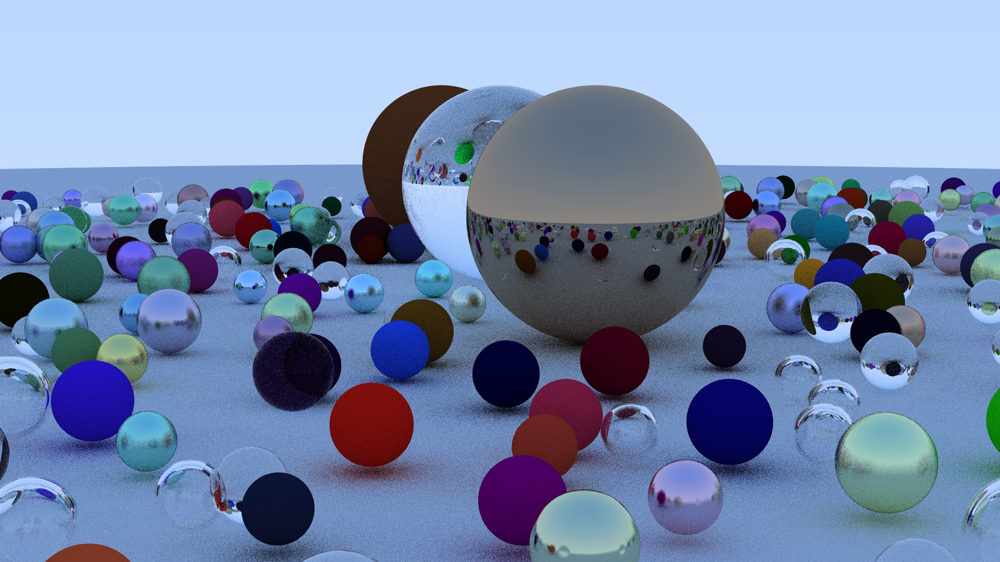

# Raytracer

A CPU path tracer written in Rust, featuring a tile-based parallel renderer exposed as an HTTP API with real-time streaming visualization.



## Features

- **Path tracing** — recursive Monte Carlo integration with configurable ray depth
- **Materials** — Lambertian diffuse, Metal (with roughness), and Dielectric (refraction + Fresnel)
- **Camera** — configurable FOV, position/orientation, depth of field, and multi-sample anti-aliasing
- **Parallel rendering** — tile-based CPU parallelization via Rayon
- **Live preview** — tiles streamed to the browser in real time via Server-Sent Events (SSE)
- **HTTP API** — load scenes, configure the camera, and start renders over REST
- **PNG export** — save the finished framebuffer to disk

## Project Structure

This is a Cargo workspace with five crates:

| Crate | Role |
|-------|------|
| `rt-core` | Shared types: `Vec3`, `Color`, `Ray`, `Camera`, `Job`, DTOs |
| `rt-scene` | Geometry (`Sphere`), materials, `Hittable` / `Material` traits |
| `rt-renderer` | Tile renderer, path tracer, normal tracer, framebuffer, PNG export |
| `rt-server` | Axum HTTP server — scene/camera/render endpoints + SSE stream |
| `rt-worker` | Distributed worker skeleton (work in progress) |

## Getting Started

### Prerequisites

- Rust toolchain (edition 2024, stable or nightly)
- Python 3 with `requests` (only needed for the scene generator script)

### Build

```bash
cargo build --release
```

### Run the server

```bash
cargo run -p rt-server
# Listening on http://127.0.1.1:3000
```

### Generate a scene and render

In a second terminal, run the bundled Python script to POST a procedurally generated scene (484 spheres) and kick off the render:

```bash
cd scripts
python generate_scene.py
```

Open `index.html` in a browser to watch tiles arrive in real time.

## API

| Method | Path | Description |
|--------|------|-------------|
| `GET` | `/health` | Liveness check |
| `GET` | `/camera` | Current camera configuration |
| `PUT` | `/camera` | Update camera configuration |
| `GET` | `/scene` | Current scene (materials + objects) |
| `POST` | `/scene` | Load a new scene |
| `POST` | `/render` | Start rendering (`tile_size`, `max_depth` params) |
| `GET` | `/render/stream` | SSE stream of rendered tiles |

### Example: load a scene

```bash
curl -X POST http://127.0.1.1:3000/scene \
  -H 'Content-Type: application/json' \
  -d @scenes/spheres_scene.json
```

### Example: start a render

```bash
curl -X POST http://127.0.1.1:3000/render \
  -H 'Content-Type: application/json' \
  -d '{"tile_size": 64, "max_depth": 50}'
```

## Scene Format

Scenes are JSON documents with a `materials` map and an `objects` list:

```json
{
  "materials": {
    "ground": { "type": "Lambertian", "albedo": [0.5, 0.5, 0.5] },
    "mirror":  { "type": "Metal",      "albedo": [0.8, 0.8, 0.8], "fuzz": 0.0 },
    "glass":   { "type": "Dielectric", "refraction_index": 1.5 }
  },
  "objects": [
    { "type": "Sphere", "center": [0, -1000, 0], "radius": 1000, "material": "ground" },
    { "type": "Sphere", "center": [0,  1,    0], "radius": 1,    "material": "glass"  }
  ]
}
```

Camera configuration is a separate JSON document sent to `PUT /camera`.

## Benchmarking

Measurements live in `bench/history.jsonl`, one JSON object per run. See
`crates/rt-bench/cli_guide.md` for the full CLI.

```bash
cargo build --release -p rt-bench
./target/release/rt-bench run --config full --build
```

### Hardware generations

Wall time only compares within one machine *and* one configuration of that
machine. `bench/hardware.toml` names the current one, and every record carries
it at the top level:

```toml
current = "gen1"

[gen1]
description = "i7-14700HX, 24 threads, Linux VM on a Windows host, high performance"
```

**Bump `current` before measuring on new hardware** — a new machine, a different
power plan, a server. Otherwise the discontinuity gets mixed in with your code
changes and there is no way to separate them afterwards.

This is not hypothetical: `gen0` exists because the Windows host had power
saving enabled, which made every measurement up to 2026-08-19 run 1.40x slower.
The guest cannot see the host's power policy — `cpu_mhz` was `null` in all of
those records — so nothing caught it.

Ratios measured *within* a single interleaved run stay valid across the
boundary. Absolute numbers and cross-generation comparisons do not.

```bash
./target/release/rt-bench run --hardware server1     # one-off override
python3 scripts/plot_evolution.py --hardware gen1    # plot one generation
python3 scripts/plot_evolution.py --hardware         # all of them, with a warning
```

### Stale binaries

`rt-bench` measures the renderer linked *into itself*, so running an old binary
measures old code under the new commit's label. It refuses to run when any
source file is newer than the binary; `--build` rebuilds and re-execs instead.

## Architecture Notes

- The renderer runs on a dedicated thread pool (Rayon). Each tile is processed independently and its result is broadcast over a Tokio channel.
- The SSE handler subscribes to that broadcast channel and forwards tiles as JSON events.
- `AppState` uses `Arc<RwLock<_>>` for scene/camera and an `Arc<FrameBuffer>` (internally `Arc<RwLock<Vec<u8>>>`) for the pixel buffer.
- The `rt-worker` crate is a placeholder for future distributed rendering over a job queue.
